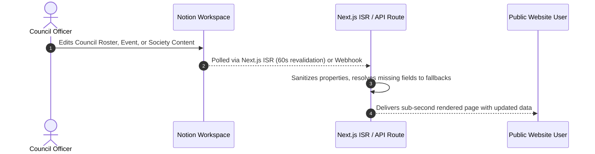
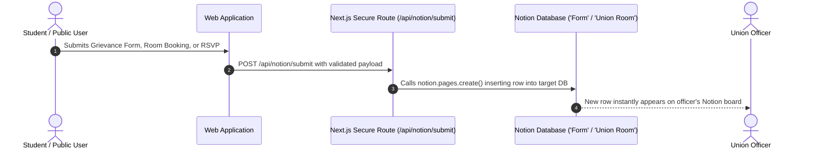

# Bi-Directional Synchronization Engine Specification

## 1. Overview & Objectives

The BFSU digital ecosystem operates across two distinct data stores:
1. **Supabase (PostgreSQL & GoTrue Auth)**: System of Record (SoR) for student accounts, authentication, security credentials, and transactional state.
2. **Notion Workspace ("Students' Union - FOB @ UOM")**: System of Engagement (SoE) and operational headless CMS for student council officers and society committees.

This specification details the **Bi-Directional Synchronization Engine** that harmonizes both platforms in near real-time without vendor lock-in or fragile coupling.

---

## 2. Universal Identity Resolution

The universal foreign key binding a student's public web profile with their Notion record is the **Institutional Email**:
`[username].[batch]@uom.lk` (e.g. `kumarasdns.22@uom.lk`)

```text
┌─────────────────────────────────┐                 ┌─────────────────────────────────┐
│       SUPABASE (Identity)       │                 │       NOTION (Operations)       │
├─────────────────────────────────┤                 ├─────────────────────────────────┤
│ Table: `auth.users`             │                 │ Database: `Committee Members`   │
│ • id: UUID                      │                 │ • Member Name: Title            │
│ • email: kumarasdns.22@uom.lk   │◄───────────────►│ • Email: kumarasdns.22@uom.lk   │
│                                 │  MATCH ON EMAIL │ • Role: Vice President          │
│ Table: `public.profiles`        │                 │                                 │
│ • username: naveen-sandeepa     │                 │ Database: `People`              │
│ • verified: true                │                 │ • Email: kumarasdns.22@uom.lk   │
└─────────────────────────────────┘                 └─────────────────────────────────┘
```

### Identity Resolution Protocol
1. When a student logs in via Google SSO with `@uom.lk`, their profile is verified.
2. The web client queries the Notion `Committee Members` database for matching `Email == student.email`.
3. If a match is found:
   - The user is automatically granted the verified **Council Executive Badge** (`Vice President`, `Secretary`, etc.).
   - Their 4-tier profile progression (Micro Avatar $\rightarrow$ Peek Modal $\rightarrow$ Full Canonical Profile `/u/[username]`) displays their Notion title and contact information dynamically.
   - If they have no matching record in Notion, they operate as a general undergraduate student.

---

## 3. Data Flow Pipelines

### Pipeline A: Forward Sync (Notion $\rightarrow$ Web)



#### Endpoints & Adapters:
- `GET /api/notion/status`: Diagnostic endpoint reporting workspace connectivity and database record counts.
- `GET /api/notion/council`: Returns sanitized, priority-sorted executive council members.
- `GET /api/notion/events`: Returns upcoming and past events with categorized tags.
- `GET /api/notion/societies/[slug]`: Pulls rich markdown blocks from society Notion pages.

---

### Pipeline B: Reverse Sync (Web $\rightarrow$ Notion)



#### Supported Reverse Sync Actions:
1. **Student Grievances & Inquiries**:
   - Web Target: Contact / Grievance form on `/contact`
   - Notion Destination: `Form` database (`2dc3b460dd9e80bb...`)
   - Mapped Properties: `Name`, `Email`, `Category`, `Message`, `Status: New`
2. **Union Room Reservation Inquiries**:
   - Web Target: `/services/room-booking`
   - Notion Destination: `Union Room` database (`2dc3b460dd9e803c...`)
   - Mapped Properties: `Requester`, `Purpose`, `Time Slot`, `Status: Pending`
3. **Event RSVP Registrations**:
   - Web Target: "RSVP" button on `/events`
   - Notion Destination: Event registration tracker

---

## 4. Error Tolerance & Graceful Degradation

To ensure stability under all network and API conditions:
1. **Rate Limiting Resilience**: Notion API limits requests to ~3 requests per second per token. Next.js ISR caches all database queries on edge nodes, ensuring 10,000 public visitors generate at most 1 Notion API request per minute.
2. **Missing Property Shield**: If any property is absent from Notion, the parser assigns an intelligent default (e.g. initial-based avatar, generic venue, placeholder description).
3. **Audit Trail**: Every failed sync attempt logs an incident to console and returns the cached fallback payload without returning HTTP 500 to the client.
