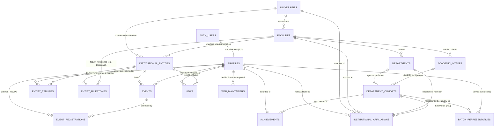
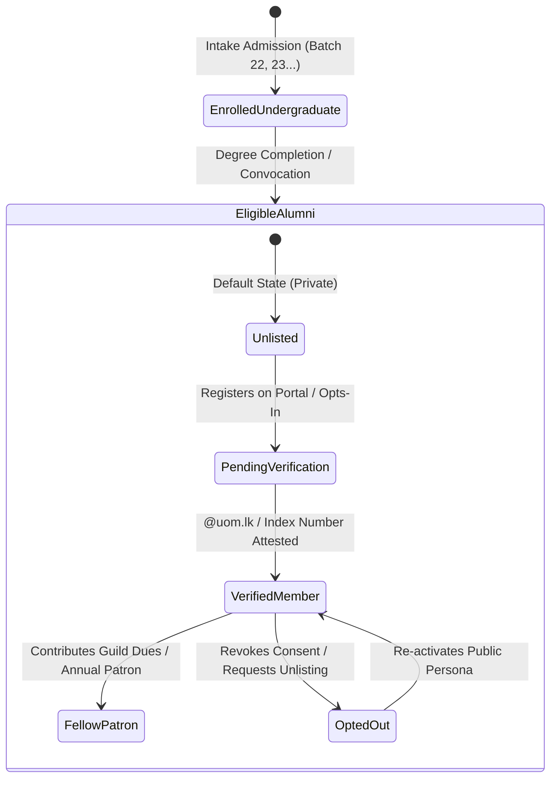

# Unified Institutional Domain Model & Entity Relationship Architecture

## 1. Executive Summary & Vision

The **Business Faculty Students' Union (BFSU)** digital ecosystem operates as the unified operational and public gateway for the **Faculty of Business (FOB)** at the **University of Moratuwa (UoM)**.

This architecture formalizes four foundational institutional realities:
1. **First-Class Person Identity (`Person` / `Profile`)**: Every individual exists as an autonomous, standalone entity with their own unique identifier (`id` linked to `auth.users(id)`). They come with their own personal attributes (name, verified avatar, email, credentials, bio, portfolio) completely independent of any single role or organization.
2. **Institutional Hierarchy & Relational Scope**:
   - **University Level (Level 0)**: University of Moratuwa (`UoM`) — the apex charter containing all academic faculties, administrative bodies, and the central university-wide student union (UoM Students' Union).
   - **Faculty Level (Level 1)**: Faculty of Business (`FOB`) — established in 2017, one of several specialized faculties (alongside Engineering, Architecture, Information Technology, and Medicine). Has its own history, milestones, deanery, and decennial timeline.
   - **Departmental Level (Level 2)**: The 3 Academic Departments under FOB:
     - Department of Decision Sciences (DS)
     - Department of Management of Technology (MOT)
     - Department of Industrial Management (IM)
   - **Statutory Faculty Union**: Business Faculty Students' Union (`BFSU`) — the apex student governing body for the Faculty of Business.
   - **Departmental Student Societies (Level 3)**: 3 specialized academic student societies (one per department):
     - **SOBA**: Society of Business Analytics (Department of Decision Sciences)
     - **BPMSS**: Business Process Management Students' Society (Department of Management of Technology)
     - **FSMSS**: Financial & Service Management Student Society (Department of Industrial Management)
3. **Academic Intakes, Departmental Cohorts & Batch Representatives**:
   - Each entry year forms an **Intake** (e.g., `Batch 20`, `Batch 21`, `Batch 22`, `Batch 23`).
   - Within each intake, students specialize across the 3 departments, forming **Department Cohorts** (`Batch 22 DS`, `Batch 22 MOT`, `Batch 22 IM`).
   - Each `(Batch x Department)` cohort elects/appoints **Batch Representatives** (typically **2 representatives** per cohort) bounded to an academic term (can be extended or reduced).
4. **Union & Society Governance Tenures & Living History**:
   - Union governance is a distinct layer: individuals later get elected or appointed to roles in the Union (`BFSU`) or Societies (`SOBA`, `BPMSS`, `FSMSS`).
   - Every office held is recorded as a time-bounded **Tenure** tied to an academic session (e.g. `2024/2025`, `2025/2026`).
   - The Union and Societies maintain their own unbroken historical continuity, milestones, and session ledgers.
5. **Universal Artifact Attribution**:
   - All web artifacts (News circulars, Events, Achievements, Web maintenance credits) are attributed either to:
     - An individual (`author_id` / `organizer_id` $\rightarrow$ `profiles.id`)
     - A team or cohort (`cohort_id` $\rightarrow$ `department_cohorts.id`)
     - An institutional entity without a specific individual (`entity_id` $\rightarrow$ e.g. "BFSU Secretariat" or "BPMSS Board").

---

## 2. Institutional Hierarchy & Organizational Scope

```text
┌────────────────────────────────────────────────────────────────────────────────────────┐
│                              UNIVERSITY LEVEL (Level 0)                                │
│                            University of Moratuwa (UoM)                                │
│                     • Charters, Central Milestones, University Crest                   │
│                     • Apex University Union (UoM Students' Union)                      │
└───────────────────────────────────────────┬────────────────────────────────────────────┘
                                            │ 1 : N
                                            ▼
┌────────────────────────────────────────────────────────────────────────────────────────┐
│                                FACULTY LEVEL (Level 1)                                 │
│                               Faculty of Business (FOB)                                │
│                (One of several faculties alongside Eng, Arch, IT, Med)                │
│                     • Established 2017 • Deanery & Institutional Charter               │
│                     • Decennial Milestone Timeline (2017 - 2027)                       │
└───────────────────┬────────────────────────────────────────────────┬───────────────────┘
                    │ 1 : 1                                          │ 1 : N
                    ▼                                                ▼
┌──────────────────────────────────────┐          ┌──────────────────────────────────────┐
│       STATUTORY FACULTY UNION        │          │        3 ACADEMIC DEPARTMENTS        │
│   Business Faculty Students' Union   │          │  1. Dept. of Decision Sciences (DS)  │
│                (BFSU)                │          │  2. Dept. of Mgmt. of Tech. (MOT)    │
│  • Executive Committee Roster        │          │  3. Dept. of Industrial Mgmt. (IM)   │
│  • Annual Sessions (2024/25, 2025/26)│          │  • Academic Staff & Heads of Dept    │
│  • Editorial Board & Web Maintainers │          │  • Curricula & Degree Specializations│
│  • Union Central Notion Hub          │          └──────────────────┬───────────────────┘
└──────────────────────────────────────┘                             │ 1 : 1
                                                                     ▼
                                                  ┌──────────────────────────────────────┐
                                                  │       3 DEPARTMENTAL SOCIETIES       │
                                                  │  1. Society of Business Analytics    │
                                                  │     (SOBA / Decision Sciences)       │
                                                  │  2. Business Process Management SS   │
                                                  │     (BPMSS / MOT Department)         │
                                                  │  3. Financial & Service Mgmt. SS     │
                                                  │     (FSMSS / IM Department)          │
                                                  │  • Society Boards & Annual Sessions  │
                                                  │  • Dedicated Society Notion Hubs     │
                                                  └──────────────────────────────────────┘
```

---

## 3. High-Level Entity-Relationship Model



---

## 4. Entity Schema Specifications

### 4.1 Standalone Individual: `profiles`
The first-class individual identity unattached to any single role.
```sql
CREATE TABLE public.profiles (
    id UUID PRIMARY KEY REFERENCES auth.users(id) ON DELETE CASCADE,
    username TEXT UNIQUE, -- e.g. 'naveen-sandeepa'
    full_name TEXT NOT NULL,
    display_name TEXT,
    email TEXT UNIQUE,
    phone TEXT,
    avatar_url TEXT, -- Resiliently synced from LinkedIn, Supabase upload, or Notion
    bio TEXT,
    headline TEXT,
    student_id TEXT, -- e.g. '226067E'
    linkedin_url TEXT,
    github_url TEXT,
    portfolio_url TEXT,
    is_verified BOOLEAN DEFAULT false NOT NULL,
    is_public BOOLEAN DEFAULT true NOT NULL,
    created_at TIMESTAMP WITH TIME ZONE DEFAULT timezone('utc'::text, now()) NOT NULL
);
```

### 4.2 Academic Intakes & Department Cohorts
Models the annual entry batches and their 3 department cohorts.
```sql
CREATE TABLE public.academic_intakes (
    id UUID PRIMARY KEY DEFAULT gen_random_uuid(),
    faculty_id UUID NOT NULL REFERENCES public.faculties(id) ON DELETE CASCADE,
    batch_name TEXT UNIQUE NOT NULL, -- 'Batch 20', 'Batch 21', 'Batch 22', 'Batch 23'
    enrollment_year INTEGER NOT NULL,
    expected_graduation_year INTEGER NOT NULL,
    is_graduated BOOLEAN DEFAULT false NOT NULL,
    created_at TIMESTAMP WITH TIME ZONE DEFAULT timezone('utc'::text, now()) NOT NULL
);

CREATE TABLE public.department_cohorts (
    id UUID PRIMARY KEY DEFAULT gen_random_uuid(),
    intake_id UUID NOT NULL REFERENCES public.academic_intakes(id) ON DELETE CASCADE,
    department_id UUID NOT NULL REFERENCES public.departments(id) ON DELETE CASCADE,
    cohort_code TEXT UNIQUE NOT NULL, -- 'B22-DS', 'B22-MOT', 'B22-IM'
    cohort_name TEXT NOT NULL, -- 'Batch 22 Decision Sciences'
    created_at TIMESTAMP WITH TIME ZONE DEFAULT timezone('utc'::text, now()) NOT NULL
);
```

### 4.3 Batch Representatives: `batch_representatives`
Models the elected/appointed student representatives (usually 2 per cohort), time-bounded and adjustable.
```sql
CREATE TABLE public.batch_representatives (
    id UUID PRIMARY KEY DEFAULT gen_random_uuid(),
    cohort_id UUID NOT NULL REFERENCES public.department_cohorts(id) ON DELETE CASCADE,
    profile_id UUID NOT NULL REFERENCES public.profiles(id) ON DELETE CASCADE,
    academic_year_term TEXT NOT NULL, -- '2024/2025', '2025/2026'
    is_current BOOLEAN DEFAULT true NOT NULL,
    term_start DATE,
    term_end DATE, -- Can be extended or reduced based on university senate approvals
    rep_number INTEGER DEFAULT 1 NOT NULL, -- 1 or 2
    created_at TIMESTAMP WITH TIME ZONE DEFAULT timezone('utc'::text, now()) NOT NULL,
    UNIQUE (cohort_id, profile_id, academic_year_term)
);
```

### 4.4 Institutional Entities (Unions & Departmental Societies): `institutional_entities`
```sql
CREATE TABLE public.institutional_entities (
    id UUID PRIMARY KEY DEFAULT gen_random_uuid(),
    entity_type TEXT NOT NULL, -- 'central_union', 'faculty_union', 'departmental_society', 'editorial_board'
    faculty_id UUID REFERENCES public.faculties(id) ON DELETE CASCADE,
    department_id UUID REFERENCES public.departments(id) ON DELETE SET NULL,
    code TEXT UNIQUE NOT NULL, -- 'BFSU', 'SOBA', 'BPMSS', 'FSMSS'
    name TEXT NOT NULL,
    slug TEXT UNIQUE NOT NULL,
    description TEXT NOT NULL,
    established_year INTEGER,
    notion_workspace_url TEXT,
    notion_database_id TEXT,
    logo_url TEXT,
    banner_url TEXT,
    created_at TIMESTAMP WITH TIME ZONE DEFAULT timezone('utc'::text, now()) NOT NULL
);
```

### 4.5 Time-Bounded Entity Tenures & Living Ledgers: `entity_tenures`
Models elected or appointed roles for specific annual sessions in the Union or Societies.
```sql
CREATE TABLE public.entity_tenures (
    id UUID PRIMARY KEY DEFAULT gen_random_uuid(),
    entity_id UUID NOT NULL REFERENCES public.institutional_entities(id) ON DELETE CASCADE,
    profile_id UUID NOT NULL REFERENCES public.profiles(id) ON DELETE CASCADE,
    role_title TEXT NOT NULL, -- 'President', 'Vice President', 'Secretary', 'Junior Treasurer', 'Editor', 'Committee Member'
    appointment_type TEXT DEFAULT 'elected' NOT NULL, -- 'elected', 'appointed', 'ex-officio', 'staff_advisor'
    session_term TEXT NOT NULL, -- '2025/2026', '2024/2025', '2023/2024'
    priority_order INTEGER DEFAULT 10 NOT NULL,
    start_date DATE,
    end_date DATE,
    is_current BOOLEAN DEFAULT true NOT NULL,
    key_initiative_summary TEXT, -- e.g. "Canteen Subsidy Reform & Analytics Hackathon"
    created_at TIMESTAMP WITH TIME ZONE DEFAULT timezone('utc'::text, now()) NOT NULL
);
```

### 4.6 Universal Web Artifact Attribution
Attributes articles, events, achievements, and code maintenance back to individuals or entities:
```sql
-- News Circulars: can be authored by an individual or an institutional entity
ALTER TABLE public.news
ADD COLUMN IF NOT EXISTS author_id UUID REFERENCES public.profiles(id) ON DELETE SET NULL,
ADD COLUMN IF NOT EXISTS author_name TEXT DEFAULT 'BFSU Secretariat',
ADD COLUMN IF NOT EXISTS entity_id UUID REFERENCES public.institutional_entities(id) ON DELETE SET NULL;

-- Events: hosted by entity, organized by student lead/committee
ALTER TABLE public.events
ADD COLUMN IF NOT EXISTS hosted_by_entity_id UUID REFERENCES public.institutional_entities(id) ON DELETE SET NULL,
ADD COLUMN IF NOT EXISTS organizer_id UUID REFERENCES public.profiles(id) ON DELETE SET NULL;

-- Achievements: won by an individual, cohort, or society
ALTER TABLE public.achievements
ADD COLUMN IF NOT EXISTS entity_id UUID REFERENCES public.institutional_entities(id) ON DELETE SET NULL,
ADD COLUMN IF NOT EXISTS cohort_id UUID REFERENCES public.department_cohorts(id) ON DELETE SET NULL;
```

---

---

## 5. Summary of Naming & Scope Corrections

1. **BPMSS Confirmed**:
   - `BPMSS` (Business Process Management Students' Society) is the official society of the Department of Management of Technology.
   - Replaced all legacy references across code, navigation, schemas, and documentation.
2. **First-Class Person Identity**:
   - Every individual has an autonomous identity with multi-source avatar sync (LinkedIn / Google / Supabase / Notion) and zero fake mock fallbacks.
3. **Academic Intakes & Department Cohorts**:
   - Students belong to their specific `Batch x Department` group (e.g. Batch 22 Decision Sciences).
   - Each group elects/appoints 2 Batch Representatives whose term is bounded to an academic session and can be extended or reduced.
4. **Union & Society Governance Tenures**:
   - Union governance is a distinct layer. Elected offices are time-bounded tenures linked to an annual session, preserving full historical continuity.
5. **Universal Artifact Attribution**:
   - All news, events, achievements, and maintenance credits are attributed to individuals, cohorts, or institutional entities.

---

## 6. Alumni Ingress Gating & Membership Lifecycle

Graduation from the university and inclusion in the public alumni directory are strictly distinct events governed by personal consent and institutional verification:



### 6.1 Mutual Exclusivity
- An active undergraduate student and an alumnus are mutually exclusive lifecycle standings:
  - While enrolled: `role = 'student'` and `affiliation_type = 'undergraduate'`. They appear in the Student Roster and Batch Reps register, but are **strictly excluded** from the `/alumni` directory.
  - Upon degree completion: `role = 'alumni'` and `affiliation_type = 'alumni'`. They qualify for alumni network features and are removed from current student governance pools.
- Past leadership tenures (e.g. "BFSU President 2024/2025") remain permanently recorded in `entity_tenures`.

### 6.2 The Gating & Verification Architecture
1. **Personal Consent Gate (`directory_opt_in`)**:
   - No graduate is forced onto the public directory by default. Graduates must explicitly consent to display their current company, designation, and contact details.
2. **Institutional Verification Gate (`alumni_status`)**:
   - `eligible`: Cohort has graduated (`academic_intakes.is_graduated = true`), but graduate has not activated a public profile.
   - `pending_verify`: Registered on the web platform, awaiting index number / registry cross-check.
   - `verified_member`: Verified FOB graduate with active public directory listing.
   - `fellow_patron`: Active contributor to the BFSU Alumni Guild fund (eligible for executive networking, mentorship hosting, and chapter voting).
   - `opted_out`: Explicitly requested privacy / removal from public registers.

---

## 7. Academic Privacy & Credential Showcase Architecture

```
┌────────────────────────────────────────────────────────────────────────────────────────┐
│                        ACADEMIC DISCLOSURE ON PUBLIC PROFILES                          │
├────────────────────────────────┬───────────────────────────────────────────────────────┤
│  STRICTLY CONFIDENTIAL (NEVER) │  PUBLICLY SAFE & PRESTIGIOUS                          │
├────────────────────────────────┼───────────────────────────────────────────────────────┤
│ ❌ Specific course letter marks│ ✅ Dean's List Honor Distinction (Semester Honors)    │
│    (e.g., "MN 2010: B-")       │ ✅ Official Degree Award (BBSc Hons in Analytics/BPM) │
│ ❌ Raw decimal GPAs / SGPAs    │ ✅ Class Standing (First Class / Second Upper)        │
│    (e.g., "GPA: 3.48")         │ ✅ Coursework Competency Pillars (Modules, no marks)  │
│ ❌ Failed attempts / Resits    │ ✅ Capstone Research Thesis (Topic, Supervisor)       │
│ ❌ Disciplinary notes          │ ✅ Hackathon & National Colours Awards                │
└────────────────────────────────┴───────────────────────────────────────────────────────┘
```

### 7.1 Institutional Grade Confidentiality
- Course grades and semester numerical GPAs are legally protected confidential academic records governed by University Examination bylaws.
- The web platform **never** publishes raw decimal GPAs or letter grades. Publishing individual module marks creates grade discrimination and unhealthy academic stigma.

### 7.2 Celebratory Honors: The Dean's List
- The **Faculty Dean's List** is an official public honor roll awarded to top undergraduates (semester GPA $\ge 3.70$ or top percentile).
- Recorded in `academic_distinctions` and displayed on the student's profile as a verified badge: *"Dean's List Distinction — Faculty of Business (Semester 4 & 5)"*.

### 7.3 Curricular Competency Pillars (Coursework without Marks)
- Instead of exposing a grade transcript, the student showcases **Accredited Module Competencies**:
  - *Data Systems & Analytics*: Machine Learning for Business, Operations Research, Time Series Econometrics.
  - *Enterprise Architecture*: SAP/ERP Architectures, Digital Transformation Strategy.
- Demonstrates technical depth to corporate recruiters (LSEG, John Keells, Dialog, WSO2) without violating academic privacy.

### 7.4 Student Sovereignty & Privacy Toggles
Students retain full control via profile flags:
- `show_deans_list`: Toggle Dean's List distinction visibility.
- `show_degree_class`: Toggle display of honors class.
- `show_modules_taken`: Toggle competency module tags.
- `academic_records_visibility`: `public`, `verified_recruiters_only`, or `private`.

---

## 8. Academic Department Spaces (`/departments/[slug]`)

The platform provides dedicated academic spaces for each of the 3 departments:
1. **Department of Decision Sciences (`/departments/decision-sciences`)**:
   - Focus: Business Analytics, Machine Learning, Mathematical Optimization, Operations Research.
   - Degree: BBSc Hons in Business Analytics & Master of Business Analytics (MBAn).
   - Facilities: Advanced Business Analytics Laboratory, Decision Optimization Computing Cluster.
   - Connected Society: **SOBA** (Society of Business Analytics).
2. **Department of Management of Technology (`/departments/management-of-technology`)**:
   - Focus: Business Process Management, Enterprise Systems Architecture (SAP/ERP), Technology Strategy.
   - Degree: BBSc Hons in Business Process Management (BPM) & MBA in MOT.
   - Facilities: Enterprise Systems (SAP/ERP) Center, Digital Process Modeling Suite.
   - Connected Society: **BPMSS** (Business Process Management Students' Society).
3. **Department of Industrial Management (`/departments/industrial-management`)**:
   - Focus: Financial Services Management, Quantitative Finance, Econometrics, Risk Engineering.
   - Degree: BBSc Hons in Financial Services Management & MSc in Project Management / Quant Finance.
   - Facilities: Financial Simulation & Quantitative Trading Lab, Industrial Simulation Studio.
   - Connected Society: **FSMSS** (Financial & Service Management Student Society).

