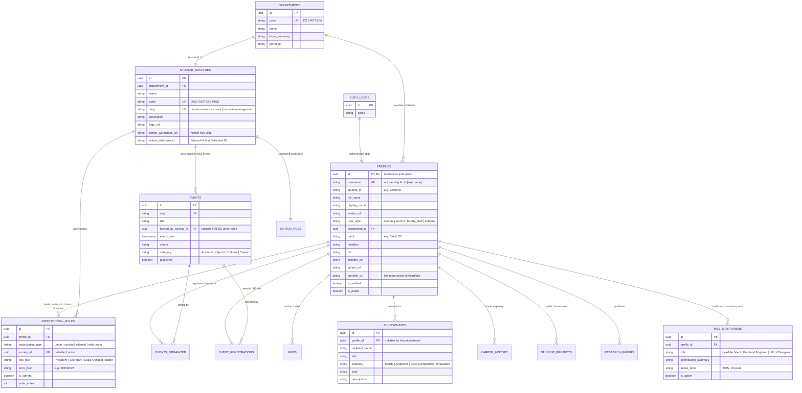

# Unified Institutional Domain Model & Entity Relationship Architecture

## 1. Executive Summary & Vision

The **Business Faculty Students' Union (BFSU)** digital ecosystem operates as the unified institutional umbrella for the **Faculty of Business (FOB)** at the **University of Moratuwa (UoM)**.

This architecture establishes:
1. **A Single Unified Identity Class (`Person` / `Profile`)**: Every individual—undergraduate student, alumnus, union executive, society board member, faculty academic, event organizer, content author, or web platform maintainer—is rooted in one canonical identity class linked to `auth.users(id)`.
2. **Institutional Hierarchy & Relational Ownership**:
   - **University Level**: University of Moratuwa (All stakeholders).
   - **Faculty Level**: Faculty of Business (FOB).
   - **Departmental Level**: The 3 Academic Departments:
     - Department of Decision Sciences (DS)
     - Department of Management of Technology (MOT)
     - Department of Industrial Management (IM)
   - **Student Governance**: Business Faculty Students' Union (BFSU) — apex faculty-wide student union.
   - **Departmental Student Societies**: 3 official student societies (one per department), each with dedicated portal spaces, leadership boards, activities, and dedicated Notion workspaces.
3. **Attribution & Accountability**: Every event, news circular, achievement, society term, and code maintenance credit is directly linked back to `user_id`.
4. **4-Tier Persona Progression**: Micro Avatar $\rightarrow$ Profile Peek Modal $\rightarrow$ Full Canonical Profile (`/u/[username]`) $\rightarrow$ Personal Portfolio Showcase.
5. **Notion Ecosystem Integration**: Official Notion workspaces for the Union (via student orgs) and the 3 departmental societies, seamlessly connected to their respective portal touchpoints.

---

## 2. Institutional Hierarchy & Organizational Scope

```text
┌────────────────────────────────────────────────────────────────────────┐
│                     University of Moratuwa (UoM)                       │
│                     Institutional Master Umbrella                      │
└───────────────────────────────────┬────────────────────────────────────┘
                                    │
                                    ▼
┌────────────────────────────────────────────────────────────────────────┐
│                        Faculty of Business (FOB)                       │
│                      Deanery & Faculty Community                       │
└───────────────────┬────────────────────────────────┬───────────────────┘
                    │                                │
                    ▼                                ▼
┌──────────────────────────────────────┐  ┌──────────────────────────────┐
│  Business Faculty Students' Union    │  │ 3 Academic Departments       │
│  (BFSU) - Apex Representative Body   │  │ • Dept. of Decision Sciences │
│  • Executive Committee               │  │ • Dept. of Mgmt. of Tech.    │
│  • Editorial & Media Board           │  │ • Dept. of Industrial Mgmt.  │
│  • Web Engineering & Maintainers     │  └──────────────┬───────────────┘
│  • Union Notion Workspace            │                 │
└──────────────────────────────────────┘                 ▼
                                          ┌──────────────────────────────┐
                                          │ 3 Departmental Societies     │
                                          │ 1. Decision Sciences Society │
                                          │ 2. MOT Student Society       │
                                          │ 3. IM Student Society        │
                                          │ • Dedicated Society Pages    │
                                          │ • Dedicated Society Notions  │
                                          └──────────────────────────────┘
```

---

## 3. High-Level Entity-Relationship Diagram (Mermaid)



---

## 4. Entity Breakdown & Class Distinctions

### 4.1 Base Identity Class: `Person` / `Profile`
Every user in the system shares a single canonical table (`public.profiles`) anchored to Supabase's `auth.users(id)`.
* **Universal Attributes**: `id`, `full_name`, `avatar_url`, `email`, `department_id`, `batch`, `linkedin_url`, `github_url`, `portfolio_url`, `is_verified`, `is_public`.
* **Polymorphic Specializations**:
  - **Current Undergraduates**: Enrolled in a department, has `student_id` (Index Number), belongs to a Batch (e.g. `'22`), participates in society and union activities.
  - **Alumni**: Graduated members with `graduation_year`, `career_history`, mentor volunteer status, and current industry position.
  - **Union Executives**: Current or past holders of BFSU office (`President`, `Secretary`, `Editor`, etc.).
  - **Society Executives**: Student society officers (e.g. `MOTSS President`, `IMSS Secretary`).
  - **Web Maintainers**: Developers, system architects, and editorial contributors responsible for building and maintaining the BFSU portal.
  - **Honorees & Achievers**: Winners of university colours, national hackathons, research awards, or inter-university competitions.

### 4.2 Institutional Entities
1. **University**: University of Moratuwa (`UoM`) - top-level institutional anchor.
2. **Faculty**: Faculty of Business (`FOB`) - encompassing all 3 academic departments and all degree programs (Business Analytics, Financial Analytics, Business Technology, Industrial Management).
3. **3 Departments**:
   - `Department of Decision Sciences` (DS)
   - `Department of Management of Technology` (MOT)
   - `Department of Industrial Management` (IM)
4. **Business Faculty Students' Union (BFSU)**:
   - Apex student body governing student welfare, major university-wide traditions (Wasath Hiru, AGERA sports encounter, Dean's assembly), and cross-departmental coordination.
5. **3 Departmental Student Societies**:
   - Official academic student societies representing the student body of each respective department.
   - Each society has:
     - Dedicated page on the portal (`/societies/[slug]`).
     - Student executive board linked to user profiles.
     - Associated events and achievements.
     - Official Notion workspace link & embedded resources.

### 4.3 Content, Event & Operations Entities
All associated actions and artifacts are attributed back to `user_id`:
* **News & Circulars (`public.news`)**:
  - `author_id` $\rightarrow$ references `profiles(id)`
  - `editor_id` $\rightarrow$ references `profiles(id)`
* **Events (`public.events`)**:
  - `hosted_by_society_id` $\rightarrow$ references `student_societies(id)` (NULL for BFSU Union-wide)
  - `organizer_id` $\rightarrow$ references `profiles(id)`
  - `event_registrations.profile_id` $\rightarrow$ references `profiles(id)`
* **Accomplishments & Hall of Fame (`public.achievements`)**:
  - `profile_id` $\rightarrow$ references `profiles(id)`
* **Web Maintainers & System Contributors (`public.web_maintainers`)**:
  - `profile_id` $\rightarrow$ references `profiles(id)`
  - Publicly visible badge and recognition on public profile & credits page.

---

## 5. The 4-Tier Public Persona Architecture

To provide seamless interaction across the website, user identity is presented at 4 distinct levels:

```text
┌────────────────────────────────────────────────────────────────────────┐
│  Tier 1: Micro / Inline Avatar (UserAvatar)                            │
│  • Inline 24px-48px avatar with status ring & verified badge           │
│  • Resilient multi-source image loading (Direct, Weserv CORS, Initials)│
│  • Click or hover triggers Tier 2 Peek                                 │
└───────────────────────────────────┬────────────────────────────────────┘
                                    │
                                    ▼
┌────────────────────────────────────────────────────────────────────────┐
│  Tier 2: Profile Peek Modal (ProfilePeekModal)                         │
│  • Lightweight modal card (340px-400px wide)                           │
│  • High-impact summary: Avatar, Name, Batch, Department, Badges        │
│  • Top 2 highlights (Union role, Society office, or Achievement)       │
│  • Quick social action links (LinkedIn, GitHub, Portfolio)             │
│  • "View Full Profile" button $\rightarrow$ navigates to Tier 3        │
└───────────────────────────────────┬────────────────────────────────────┘
                                    │
                                    ▼
┌────────────────────────────────────────────────────────────────────────┐
│  Tier 3: Canonical Full Public Profile (/u/[username])                 │
│  • Official portal address under BFSU: bfsu-uom.lk/u/naveen            │
│  • Comprehensive academic credentials & verification badge             │
│  • Institutional positions (BFSU Council, Society Board, Web Team)     │
│  • Publications, Authored Circulars, Organized Events                  │
│  • Student Projects Showcase & Career Timeline                         │
└───────────────────────────────────┬────────────────────────────────────┘
                                    │
                                    ▼
┌────────────────────────────────────────────────────────────────────────┐
│  Tier 4: Personal External Portfolio Showcase                          │
│  • Optional custom personal website / portfolio URL                    │
│  • Direct external link or embedded interactive showcase tab           │
│  • Anchored by the trusted BFSU verified badge                         │
└────────────────────────────────────────────────────────────────────────┘
```

---

## 6. Notion Ecosystem Integration

### 6.1 Notion for the Union (via Student Orgs)
* The Business Faculty Students' Union utilizes Notion for internal executive operations:
  - Meeting minutes & council resolutions
  - Annual event calendar & budgeting proposals
  - Student welfare case trackers
  - Digital media editorial pipeline
* **Portal Integration**:
  - Authenticated Executive Portal links directly into the Union Notion Workspace.
  - Public facing student resources (e.g. bylaws, guidelines, examination welfare advisories) can be selectively synced or embedded into the BFSU portal.

### 6.2 Notion for the 3 Departmental Student Societies
Each of the 3 departmental societies manages its own organizational activities:
1. **Decision Sciences Society (DSS)**:
   - Notion Hub: Project trackers, hackathon planning, data science study roadmaps.
2. **Management of Technology Student Society (MOTSS)**:
   - Notion Hub: Industry tech talks, corporate visits, innovation forums.
3. **Industrial Management Student Society (IMSS)**:
   - Notion Hub: Financial analytics workshops, supply chain clinics, alumni networking.
* **Portal Integration**:
  - Each society's dedicated portal page (`/societies/[slug]`) features a **Notion Hub Widget**:
    - Direct verified link to their official Notion space.
    - Curated embedded public Notion database or sync status.
    - Departmental resource repository for undergraduates.
