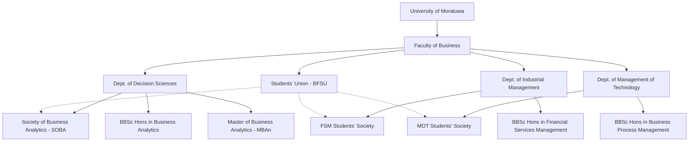
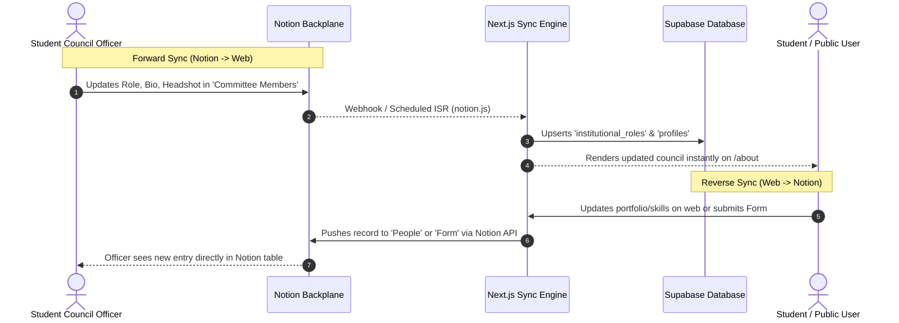

# BFSU Hybrid Enterprise Architecture: Notion Operational Backplane & Web Experience Platform

## 1. Executive Summary & Strategic Positioning

The **Faculty of Business (FOB)** at the **University of Moratuwa (UOM)** holds a unique and prestigious position in Sri Lankan higher education. While Moratuwa is internationally recognized as the country's foremost engineering and technology institution, its Faculty of Business is the pioneer of quantitative, data-driven management education in Sri Lanka.

### Key Institutional Realities
1. **Pioneering Legacy**: FOB introduced Sri Lanka's first undergraduate specialization in **Business Analytics** (BBSc Hons) and postgraduate **Master of Business Analytics (MBAn)**.
2. **Elite Academic Caliber**: The faculty attracts the highest-ranking students nationwide from the **G.C.E. Advanced Level Commerce stream** (highest national Z-score cutoffs).
3. **The 2027 Milestone**: In **2027**, the Faculty of Business will celebrate its **10th Anniversary** (founded in 2017), marking a decade of transformative impact across financial markets, technology enterprises, and corporate boardrooms.
4. **Governance Dynamic**: The web platform serves a dual master:
   - **External Flagship**: Global academic and corporate prestige, recruitment of top A/L rankers, employer talent discovery.
   - **Student-Run Agility**: Governed by the **Faculty of Business Students' Union (BFSU)** and departmental societies, who require rapid, non-technical publishing workflows.

---

## 2. Academic & Organizational Ontology

The institutional hierarchy is structured across three academic departments, three specialized degree tracks, and their corresponding student societies:



### Departmental & Society Mapping Matrix

| Department | Academic Specialization | Undergraduate Degree | Student Society (Notion & Web) | Specialization Focus |
| :--- | :--- | :--- | :--- | :--- |
| **Department of Decision Sciences (DS)** | **Business Analytics** | Bachelor of Business Science (BBSc) Hons in Business Analytics | **Society of Business Analytics (SOBA)** *(Notion ID: `30d3...7d32`)* | Machine learning, predictive analytics, optimization, statistical computing (Python/R), operations research. |
| **Department of Industrial Management (IM)** | **Financial Services Management (FSM)** | Bachelor of Business Science (BBSc) Hons in Financial Services Management | **FSM Students' Society (FSMSS)** *(Notion ID: `30d3...b294`)* | Quantitative finance, fintech, algorithmic trading, risk engineering, investment banking, actuarial concepts. |
| **Department of Management of Technology (MOT)** | **Business Process Management (BPM) / MOT** | Bachelor of Business Science (BBSc) Hons in Business Process Management | **MOT Students' Society (BPMSS)** | Enterprise architectures (ERP/SAP), technology commercialization, innovation strategy, supply chain management. |

---

## 3. The "Mobile Carrier" Hybrid Architecture

To reconcile the need for an **Ivy-League caliber web experience** with **zero-friction student operations**, the system utilizes a **Two-Tier Hybrid Architecture**:

```text
┌────────────────────────────────────────────────────────────────────────┐
│                   TIER 1: PUBLIC WEB EXPERIENCE                        │
│            Next.js 15 App Router + Supabase Auth / Postgres            │
├────────────────────────────────────────────────────────────────────────┤
│ • Sub-second static & server rendering (ISR)                           │
│ • SEO-optimized Degree Showcase & 2027 Decennial Portal                │
│ • 4-Tier Public Persona (Avatar -> Peek Modal -> Profile -> Showcase)  │
│ • Corporate Employer Talent Discovery & Alumni Directory               │
└──────────────────┬─────────────────────────────────▲───────────────────┘
                   │ Bi-directional Webhook / API    │
                   │ Sync via Institutional Email    │
┌──────────────────▼─────────────────────────────────┴───────────────────┐
│              TIER 2: NOTION OPERATIONAL BACKPLANE                      │
│            "Students' Union - FOB @ UOM" Teamspace                     │
├────────────────────────────────────────────────────────────────────────┤
│ • Zero-code content publishing for student council & society leads     │
│ • Live Executive Council roster (`Committee Members`)                  │
│ • Academic & Event Calendar (`Event calendar`)                         │
│ • Departmental Society hubs (`Society of Business Analytics`, etc.)    │
│ • Private Internal Operations (`Union Room`, `Meetings`, `Finances`)   │
└────────────────────────────────────────────────────────────────────────┘
```

### Security Boundary: Public vs. Internal-Only

| Notion Database / Page | Notion ID | Access Level | Web Exposure |
| :--- | :--- | :--- | :--- |
| `Committee Members` | `2dc3b460dd9e80479654c034a9412f40` | Public Operational | Live Council roster on `/about` and `/societies/[slug]` |
| `Event calendar` | `2dc3b460dd9e810d87b4c2de080401b5` | Public Operational | Interactive event feed on `/events` and home calendar |
| `Society of Business Analytics` | `30d3b460dd9e81dcb43bcff420397d32` | Public Operational | Headless CMS for `/societies/dss` |
| `FSM Students Society` | `30d3b460dd9e81bfa07bf533a61bb294` | Public Operational | Headless CMS for `/societies/industrial-management` |
| `Updates` / Announcements | `2dc3b460dd9e80f69fb6f4f3d60426eb` | Public Operational | News & release notes on `/news` |
| `Form` (Grievances/Submissions) | `2dc3b460dd9e80bba3b8fbf4333f7932` | Bi-directional | Web form submits into Notion; admin manages in Notion |
| `Union Room` (Room Logistics) | `2dc3b460dd9e803cacd7d5b266e34468` | **Internal Only** | Strictly confidential within union officers |
| `Meetings` (Minutes & Agendas) | `2dc3b460dd9e81c18324f03701cc31ec` | **Internal Only** | Strictly confidential union executive records |
| `2022 Finances` (Treasury) | `2dc3b460dd9e81c0bfb8d9cc5e5f4750` | **Internal Only** | Strictly confidential financial accounts |
| `To Do` (Executive Tasks) | `2dc3b460dd9e80b7aae1e8f1777b0c2e` | **Internal Only** | Internal operational task board |

---

## 4. Bi-Directional Synchronization & Identity Engine

### Identity Key: University Institutional Email
The canonical anchor linking a Supabase `auth.users(id)` with a Notion database row is the student's official university email:
`[username].[batch]@uom.lk` (e.g. `kumarasdns.22@uom.lk`)

### Synchronization Mechanics



---

## 5. Notion Database Schema Enhancements

To unlock full richness without requiring code changes, the existing Notion databases are enhanced with the following standardized properties:

### 1. `Committee Members` (`2dc3b460dd9e80479654c034a9412f40`)
- `Member Name` (Title) — Full legal/display name
- `Role` (Multi-select) — President, Vice President, Secretary, Junior Treasurer, Editor, Co-Editor, Assistant Secretary, Committee Member
- `Email` (Email) — Canonical institutional email (`...@uom.lk`)
- `Phone` (Phone Number) — Contact telephone
- `Department` (Select) — Decision Sciences, Industrial Management, Management of Technology, General
- `Batch` (Select) — Batch 21, Batch 22, Batch 23, Batch 24, Batch 25
- `Avatar` (Files & Media) — High-resolution headshot
- `Bio` (Rich Text) — Professional summary / manifesto
- `LinkedIn` (URL) — LinkedIn public profile
- `GitHub` (URL) — GitHub or portfolio URL
- `Display Priority` (Number) — 1 (President), 2 (VP), 3 (Secretary), 4 (Treasurer), 5...
- `Term Year` (Select) — `2025/2026`, `2024/2025`
- `Is Active` (Checkbox) — Controls active visibility

### 2. `Event calendar` (`2dc3b460dd9e810d87b4c2de080401b5`)
- `Name` (Title) — Event title
- `Date` (Date) — Start and end timestamp
- `Location` (Rich Text) — Venue (e.g. "Auditorium 2", "Civil Auditorium", "Virtual")
- `Category` (Select) — Academic, Career Fair, Hackathon, Cultural, Sports, Orientation
- `Host Society` (Select) — Students' Union (BFSU), Society of Business Analytics, FSM Students' Society, BPMSS
- `Cover Image` (Files & Media) — Promotional banner / poster
- `Description` (Rich Text) — Detailed agenda and requirements
- `Registration Link` (URL) — Google Form or RSVP link
- `Featured` (Checkbox) — Pins to the homepage marquee

---

## 6. Benchmarking & Innovation Pillars (The Ivy-League Standard)

Drawing inspiration from the world's leading business schools (Wharton Council, MIT Sloan Senate, Harvard Business School Student Association, NUS Bizad Club):

### Pillar A: SEO & Admissions Engine for High-School Rankers
- **High-Impact Target**: G.C.E. A/L Commerce students who achieved District/Island Ranks and are deciding their university preferences via the UGC handbook.
- **Dedicated Hub**: `/admissions/why-fob` highlighting:
  - Sri Lanka's highest graduate employment and compensation trajectories in quantitative business.
  - The distinct advantage of studying business at an engineering powerhouse (Moratuwa).
  - Curriculum breakdown: Business Analytics vs. FSM vs. BPM.

### Pillar B: Verified Moratuwa Quant Portfolio Directory
- A public directory `/talent` where corporate recruiters (LSEG, John Keells, MAS, Dialog, WSO2, Citibank) can filter students by:
  - Specialization (Business Analytics, Financial Services, Tech Management)
  - Verified technical skill badges (Python, R, Machine Learning, PowerBI, SQL, Financial Modeling)
  - Capstone projects & publications

### Pillar C: 2027 Decennial Celebration Milestone
- A dedicated countdown and interactive timeline `/10-years` celebrating 10 years of the Faculty of Business (2017–2027):
  - Founding deans, faculty members, and student union pioneers.
  - 10-year retrospective of alumni impact globally.
