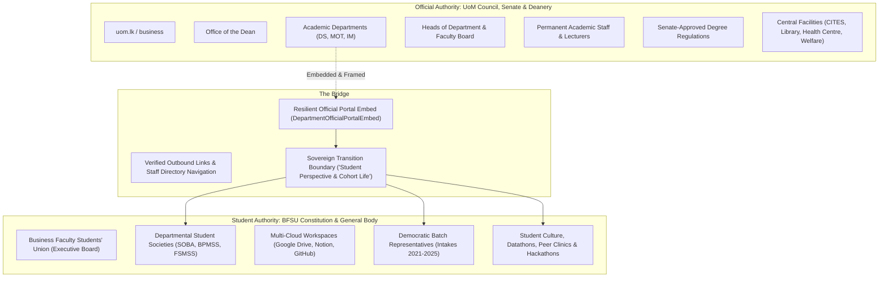

# Institutional Boundaries & The Dual-Sovereignty Architecture

> **Architectural Doctrine — BFSU Web Platform**  
> **Status**: Ratified Standard  
> **Authority**: Business Faculty Students' Union (BFSU) & Digital Systems Architecture Group  
> **Last Updated**: September 2026

---

## 1. Executive Summary & Context

As the digital ecosystem for the Faculty of Business at the University of Moratuwa matures, a critical architectural distinction must be enforced between **University Administrative Jurisdiction** and **Student Union Sovereign Jurisdiction**.

Historically, student web platforms risk **scope creep**: attempting to host academic departmental websites, hardcoding rotating Heads of Department (HODs), or duplicating official curricula and staff rosters. This creates three severe risks:
1. **Stale Administrative Data & Institutional Liability**: HOD appointments rotate, lecturers move, and curricula adapt under Senate authority. Unofficial portals displaying outdated academic rosters cause confusion and administrative friction.
2. **Identity Confusion**: Prospective applicants, external corporate partners, and international researchers may confuse an unofficial student union page for the University of Moratuwa's sanctioned faculty authority.
3. **Resource Misallocation**: Diverting student engineering resources away from student welfare, societies, and peer initiatives to maintain academic administrative pages that already belong to `uom.lk`.

To solve this permanently, BFSU-web adopts the **Dual-Sovereignty Model**.

---

## 2. The Dual-Sovereignty Model



### Realm 1: University Administrative Jurisdiction (The Faculty & Central UoM)
* **Governing Body**: University Council, Academic Senate, Deanery, and Heads of Department.
* **Scope**: Degree conferment, official course curricula, semester examination dates, staff recruitment, research centers, and departmental physical offices.
* **Architectural Strategy on BFSU-web**:
  - **Sovereign Embed & Attribution**: BFSU-web **never claims authorship or database ownership** over department administration or HOD rosters.
  - Instead, BFSU-web embeds the official `uom.lk/business` department portal via [`DepartmentOfficialPortalEmbed.jsx`](file:///c:/Users/Naween/projects/BFSU-web/src/components/departments/DepartmentOfficialPortalEmbed.jsx).
  - Outbound actions always link directly to official university sources (`uom.lk/business/decision-sciences`, staff directory, etc.).

### Realm 2: Student Union Sovereign Jurisdiction (BFSU & Societies)
* **Governing Body**: Business Faculty Students' Union (Executive Board, Constitution, General Assembly).
* **Scope**: Student welfare, representation, departmental student societies, batch cohort leadership, extracurricular events, peer bootcamps, and cross-platform collaboration.
* **Architectural Strategy on BFSU-web**:
  - **Full In-App Sovereignty**: BFSU-web is the primary system of record for student societies ([`SOBA`](file:///c:/Users/Naween/projects/BFSU-web/src/app/societies/soba), [`BPMSS`](file:///c:/Users/Naween/projects/BFSU-web/src/app/societies/bpmss), [`FSMSS`](file:///c:/Users/Naween/projects/BFSU-web/src/app/societies/fsmss)), democratic batch representatives, student project showcases, and student-run events.

---

## 3. The In-Page Split Pattern (`/departments/[slug]`)

Each academic department route ([`/departments/[slug]`](file:///c:/Users/Naween/projects/BFSU-web/src/app/departments/[slug]/page.jsx)) implements a clean two-tiered layout:

### Part 1: Official University Embed (Top Tier)
* **Attestation Banner**: Verified University of Moratuwa badge (`[OFFICIAL UNIVERSITY FACULTY DOMAIN: uom.lk/business]`).
* **Interactive Embed Viewport**: In-page frame rendering the live department website from `uom.lk`, allowing students to explore official news, staff profiles, and research from the primary source.
* **Direct Actions**:
  - `Open Official Site` (Opens `uom.lk/business/[dept]` in a new tab)
  - `Academic Staff Directory` (Opens official faculty roster)
  - Frame refresh and expand controls.

### The Boundary Transition Divider
An explicit visual separator across the page:
```
— — — — — — — [ ✨ STUDENT PERSPECTIVE & COHORT LIFE ✨ ] — — — — — — —
Curated by the Students' Union & Departmental Society • Peer Initiatives & Batch Representation
```

### Part 2: Student Perspective & Cohort Ownership (Bottom Tier)
* **Peer Culture & Student Voice**: Authentic student accounts of studying the specialization (datathons, trading labs, ERP bootcamps).
* **Departmental Student Society Hub**: Direct access to the student society space, including multi-cloud workspace links (Notion, Google Drive, GitHub).
* **Democratic Batch Representatives**: 2 elected batch reps per intake cohort with their contact points and welfare portfolios.

---

## 4. Entity Hierarchy & Classification

To maintain conceptual clarity across the entire codebase, all institutional entities are mapped into three distinct tiers:

| Tier | Entity Name | Classification | Governing Authority | Hosting Model on BFSU-web |
| :--- | :--- | :--- | :--- | :--- |
| **Level 0** | CITES, Main Library, Health Centre, Student Welfare, PE, CGU | Central University Facilities | UoM Administration & Registrar | Navigational guide on [`/links`](file:///c:/Users/Naween/projects/BFSU-web/src/views/UsefulLinksPage.jsx) with custodian roles & procedures. |
| **Level 1** | DS, IM, MOT Departments | Academic Faculty Departments | Faculty Deanery & Senate | Embedded official site + student perspective on [`/departments/[slug]`](file:///c:/Users/Naween/projects/BFSU-web/src/app/departments/[slug]/page.jsx). |
| **Level 2** | BFSU, SOBA, BPMSS, FSMSS | Student Union & Societies | Student Union & Student Committees | Fully owned in-app spaces with profiles, workspaces, and blogs on [`/societies/[slug]`](file:///c:/Users/Naween/projects/BFSU-web/src/app/societies/[slug]/page.jsx). |

---

## 5. Rules for Future Contributors & AI Agents

1. **Do Not Scatter Ad-Hoc Personnel Strings**: Never hardcode HOD names, Dean names, or staff rosters randomly inside JSX views. Always import from [`facultyAdministrationData.js`](file:///c:/Users/Naween/projects/BFSU-web/src/data/facultyAdministrationData.js) or the database service.
2. **Never Call Central Facilities 'Faculty'**: CITES, Library, Health Centre, and Welfare Division serve the entire University of Moratuwa, not just the Faculty of Business. Never prefix them with "Faculty".
3. **Respect Student Society Sovereignty**: Student societies (SOBA, BPMSS, FSMSS) are owned by their respective student committees. Their spaces must feature vendor-neutral collaboration affordances (Google Drive, Notion, GitHub) rather than locked-in proprietary tools.
4. **Preserve Fallbacks for University Embeds**: Always ensure iframe embeds have an explicit "Open in New Tab" link and fallback banner in case university firewall or `X-Frame-Options` policies restrict in-page frame viewing.

---

## 6. The "Web Stalling" Latency & The Operational Administrative Registry

### The Problem: University Web Latency
In collegiate governance, leadership changes happen via official University Council Circulars and Senate Confirmations (for example, **Prof. (Ms.) G. N. Kuruppu** assuming office as the 4th Dean of the Faculty of Business on September 15, 2026, followed by new Heads of Department for Decision Sciences and Industrial Management).

However, official university websites (`uom.lk`) frequently **stall for months** before webmasters update faculty roster pages. If the Student Union solely waits for `uom.lk`, students and committee batch representatives are left without active administrative contact points for:
- Urgent student petitions & medical board submissions
- Examination postponement appeals
- Faculty Board student representations
- Official correspondence with the Dean's Office & Assistant Registrar

### The Solution: Operational Administrative Registry (`faculty_administration_registry`)
To bridge this gap without creating chaos, BFSU-web maintains a dedicated operational registry table in Supabase (`public.faculty_administration_registry`) and a mirrored static fallback configuration ([`facultyAdministrationData.js`](file:///c:/Users/Naween/projects/BFSU-web/src/data/facultyAdministrationData.js)):

```sql
CREATE TABLE public.faculty_administration_registry (
    role_code TEXT UNIQUE NOT NULL,      -- 'DEAN', 'HOD_DS', 'HOD_IM', 'HOD_MOT', 'AR_DEAN_OFFICE'
    role_title TEXT NOT NULL,
    appointee_name TEXT NOT NULL,
    unit_name TEXT NOT NULL,
    office_location TEXT,
    email TEXT,
    phone TEXT,
    assumed_date DATE,
    term_label TEXT NOT NULL,
    is_current BOOLEAN DEFAULT true,
    source_reference TEXT,
    notes TEXT
);
```

### The Boundary Standard
1. **Operational Reference Only**: This registry is maintained as an operational contact ledger for student governance, not as an assertion of student authority over university appointments.
2. **Single Source of Truth**: All components across the application ([`AboutUs.jsx`](file:///c:/Users/Naween/projects/BFSU-web/src/views/AboutUs.jsx), [`DepartmentDetailPage.jsx`](file:///c:/Users/Naween/projects/BFSU-web/src/app/departments/[slug]/page.jsx), [`UsefulLinksPage.jsx`](file:///c:/Users/Naween/projects/BFSU-web/src/views/UsefulLinksPage.jsx)) pull from this centralized layer, preventing stale, conflicting hardcodes.
3. **Verified Council Circulars**: Updates to this registry must cite official Council appointment circulars or Faculty Board minutes in `source_reference`.

