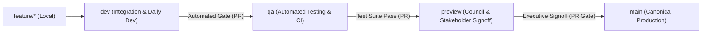

# BFSU 4-Tier Branching Model & Release Gates

This document defines the release lifecycle and gating architecture for the **Business Faculty Students' Union (BFSU)** web platform across GitHub and Vercel.

---

## 1. 4-Tier Branch Lifecycle Hierarchy

| Tier | Branch | Environment | Host / Alias | Purpose | Promotion Policy |
| :--- | :--- | :--- | :--- | :--- | :--- |
| **Tier 1** | `dev` | Development | `https://bfsu-web-git-dev-bfsu.vercel.app` | Active developer feature integration. | Direct push or PR from `feature/*`. |
| **Tier 2** | `qa` | Testing / CI Gate | `https://bfsu-web-git-qa-bfsu.vercel.app` | Full automated regression suite (`tsc`, build, security, a11y). | PR from `dev` requiring all CI checks to pass. |
| **Tier 3** | `preview` | Staging / Signoff | `https://bfsu-web-git-preview-bfsu.vercel.app` | Stable release candidate for Council / Executive review. | PR from `qa` after automated testing completes. |
| **Tier 4** | `main` | Production | `https://bfsu-uom.lk` | Public canonical portal. | **STRICT PR ONLY** from `preview` with executive signoff. |

---

## 2. Automated Quality Gates (`ci-gate.yml`)

Every Pull Request targeting `qa`, `preview`, or `main` automatically runs:
1. **TypeScript Typecheck:** `pnpm run typecheck` (`tsc --noEmit`) validates all routes and components.
2. **Link Security & Protocol Armor:** `pnpm run test:links` validates protocol anti-poisoning, runtime immutability, and safe social URL builders.
3. **WCAG 3 / APCA Accessibility Gate:** `pnpm run test:a11y` tests color contrast, deuteranopia simulation, and text polarity.
4. **Production Next.js Build:** `pnpm run build` verifies SSG/ISR static route generation across all 50+ routes.

---

## 3. GitHub Branch Protection Setup

To enforce this gate on the GitHub repository ([`FOB-UOM/BFSU-web`](https://github.com/FOB-UOM/BFSU-web)):

1. Go to **Settings** > **Branches** > **Add branch ruleset** (or **Branch protection rules**).
2. For branch pattern `main`:
   - Check **Require a pull request before merging** (Require 1 approval).
   - Check **Require status checks to pass before merging**:
     - Search and select: `Typecheck, Security, A11y & Production Build`.
   - Check **Do not allow bypassing the above settings**.
   - Check **Restrict deletions and force pushes**.
3. For branch pattern `preview`:
   - Require status checks to pass before merging.
4. For branch pattern `qa`:
   - Require status checks to pass before merging.
